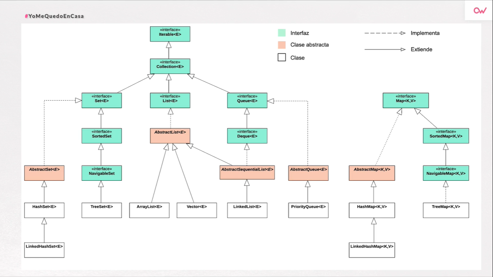
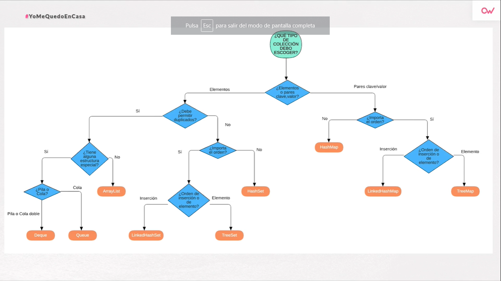

# Colecciones Java (Resumen)

## Concepto
Una colección es un contenedor para un conjunto de elementos de un tipo en una sola unidad.
Se usan para el almacenamiento, recuperación y manipulación de datos.

Las colecciones estan disponibles en Java desde la versión 2.
Pertenecen al paquete java.util

## Interfaces y clases en Java

## Iterable< E >
- Patrón de diseño que permite recorrer y eliminar una sucesión de elementos.
- Permite ser recorrido mediante el uso de un bucle for-each o el método forEach.

## Collection< E >
- Extiende a Iterable heredando su funcionalidad.
- Collection representa a un grupo de elementos.
- El resto de interfaces heredan de Collection (salvo Map y derivados).
- También permite tener una serie de métodos comunes a casi todos los tipos de colecciones.
- JDK no ofrece implementación directa de esta interfaz.
- Sirve para manipular colecciones de una forma general.

Las operaciones disponibles son las siguientes:
- Verificación de tamaño: size y isEmpty
- Comprobación de elementos: contains
- Añadir y eliminar elementos: add y remove
- Iterar: iterator
- Operaciones con un conjunto de datos: containsAll, addAll, removeAll, removeIf, retainAll, clear
- Transformar en array: toArray
- Streams: stream, parallelStream

## Set< E >
- Se trata de un Collection que no permite elementos duplicados.
- Es una abstracción del concepto matemático de conjunto.
- No añade ningún método a los heredados de Collection.
- No hay acceso "posicional".
- Mejora la implementación de los métodos equals y hashCode con respecto a Collection.
- A la hora de comparar, dos instancias de Set son iguales si contienen los mismos elementos.

Las implementaciones concretas de Set son las siguientes:
- HashSet< E >: la más rápida de todas.
- LinkedHashSet< E >: hereda de la anterior, es un poco más lenta pero respeta el orden de inserción de los elementos.
- TreeSet< E >: la más lenta, permite ordenar los elementos según su valor.

## List< E >
- Se trata de un Collection que si que permite duplicados.
- Añade las siguientes funcionalidades:
  - Acceso posicional
  - Búsqueda
  - Iteración extendida
  - Operaciones sobre un rango de elementos de la lista
  
Las implementaciones concretas de List son las siguientes:
- ArrayList< E >: la más utilizada.
- Vector< E >: la más antigua (primera versión de Java), implementación sincronizada, adecuada para uso en un contexto de concurrencia pero usa métodos legacy por lo que no es muy recomendable.
- LinkedList< E >: también implementa la interfaz Queue< E > y Deque < E >, es eficiente solamente en algunas situaciones bastante concretas.

## Map < K,V >
- No hereda de Collection a diferencia de las anteriores.
- Maneja pares clave, valor.
- Para cada clave, hay un solo valor.
- Cada clave puede existir una sola vez en el map, no puede estar repetida.
- Puede haber una clave nula y múltiples valores nulos.
- En otros lenguajes de programación se le conoce como diccionario.
- Al igual que las anteriores, no permite almacenar tipos primitivos; hay que usar tipos wrapper (envoltorio) en su lugar (int -> Integer).

Cabe destacar una clase -> Map.Entry< K, V >:
- Es una clase que permite consultar un par clave, valor de un Map.
- No se pueden utilizar para insertar valores.
- Se puede obtener un Set< Map.Entry< K, V >> a través del método Map.entrySet().

Las operaciones más comunes con Map son las siguientes:
- Insertar una clave y su valor
  - put(key,value)
- Obtener un valor en base a la clave
  - get(key)
- Consultar si una clave o un valor están contenidos
  - containsKey(key) / containsValue(value)
- Eliminar el par clave, valor
  - remove(key)
- Recorrer un Map (dos opciones)
  - Opción 1: forEach
    Se obtiene mediante el método entryKey un Set con las claves y para cada clave     se obtienen los valores.
  - Opcion 2: Usando el lambdas
    Mediante el método forEach y la expresión lambda (biconsumer).

## Colecciones para situaciones especiales
Java también ofrece colecciones para situaciones especiales:
- Son colecciones que, una vez creadas, no se pueden modificar.
- Si se tratan de modificar, se lanza una excepción (UnsupportedOperationException)
- Se pueden usar, por ejemplo, como resultado de una operación.
- Hasta Java 8 existían:
  - Método Collections.unmodifiableXXX(coleccion): devuelve una versión no modificable de la colección.
  - Método Collections.emptyXXX: devuelve una colección vacia no modificable.
- Desde Java 9 tenemos:
  - Los métodos factoria.of(...)
  - Diferentes versiones de los mismos: desde 0 elementos hasta un número variable.
  - Disponibles en los diferentes interfaces: List, Set, Map...
  
## Colecciones sincronizadas
- Aptas para el uso en un contexto multihilo, ninguna de las colecciones anteriores son thread-safe.
- Versión sincronizada de una colección no sincronizada.
  - Se envolvería cualquiera de las colecciones no sincronizadas que se han visto anteriormente con el método Collections.synchronizedXXX.
  
## Algoritmos para colecciones
Hay disponibles algoritmos para bastantes operaciones, sin embargo las más clasicas son las siguientes:

- Ordenar/Desordenar
- Búsqueda
- Operaciones: max/min, frecuencia...

## Algoritmos de ordenación
- Collections.sort(list)
  - Recibe una colección de tipo List< E >
  - Modifica la colección que recibe.
  - Los elementos deben implementar Comparable.
  
- Collections.sort(list, comparator)
  - Implementación que ordena según el orden inducido por la instancia de comparator.

* En ambos casos, el algoritmo usado es Merge Sort.

## Algoritmos de desordenación
- Collections.shuffle(list)
  - Realiza la operación opuesta a sort
  - Desordena los elementos de una colección
  
- Collections.shuffle(list, random)
  - Versión del anterior, donde el componente aleatorio se le puede proporcionar.
  
## Algoritmos de búsqueda
- Búsqueda binaria.
- La lista debe estar ordenada previamente.
- Si hay varias ocurrencias, no se garantiza cual se va a encontrar.
- Devuelve:
  - el índice del elemento si lo encuentra
  - si no, devuelve el siguiente valor -> (-(punto de inserción)-1) que sería una manera de mezclar un booleano y un número entero, el cual devuelve un valor menor que cero si no lo encuentra mientras que devuelve el punto de inserción en caso de encontrarlo.
  
## Algoritmos para algunas operaciones
- Máximo y mínimo
  - Acorde al orden natural.
  - Otra implementación con un Comparator.
  - Aplicable a Collection.
  
- Frecuencia
  - Devuelve el número de ocurrencias de un objeto en una colección.
  
## ¿Como saber que tipo de colección escoger?

Para ello se puede utilizar el siguiente diagrama con el que deberemos de preguntarnos, siguiendo las líneas, las necesidades que tenemos.

## Librerías de colecciones de terceros
Las librerías de otros proveedores más usuales son las siguientes:
- Guava (Google)
- Eclipse Collections (Eclipse)
- Apache Commons Collections (Apache)

**Guava:**
- Implementada por Google.
- Disponible tanto en Java como en Android.
- Constructores mejorados.
- Iterable allá donde sea posible.
- Más métodos factoría.
- Operaciones de conjuntos (unión, intersección, prod. cartesiano).
- BiMaps, Multisets, Multimaps, Tables.

**Eclipse Collections:**
- API más legible (métodos más expresivos).
- Múltiples métodos factoría para colecciones mutables.
- Colecciones para tipos primitivos sin tener que usar los tipos envoltorio.
- Gestión de memoria mejorada.
- BiMaps, Multimaps, Bags...

**Apache Commons Collections:**
- Colecciones tipo Bag.
- BidiMap: mapas clave -> valor y valor -> clave.
- MapIterator para recorrer un map convenientemente.
- Colecciones compuestas.
- Muchas implementaciones de iteradores, comparadores...

# Bibliografía
Toda la información de este resumen ha sido recabada del siguiente taller de OpenWebinars: [Manejo de colecciones en Java](https://openwebinars.net/academia/aprende/colecciones-java)

> :star: Si te ha gustado este resumen dale una estrellita al [repositorio](https://github.com/ismaelpacheco13/coleccionesJava)
